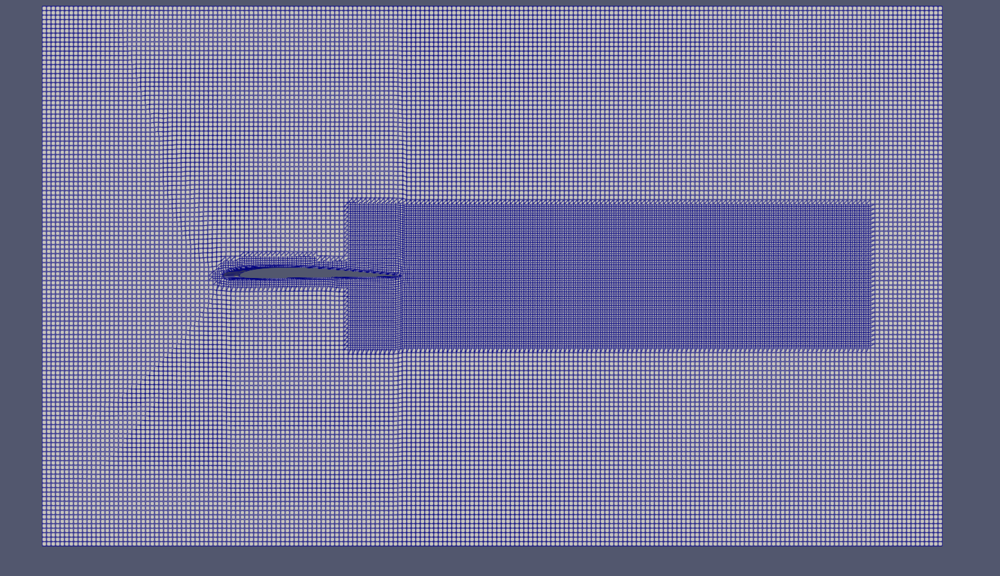
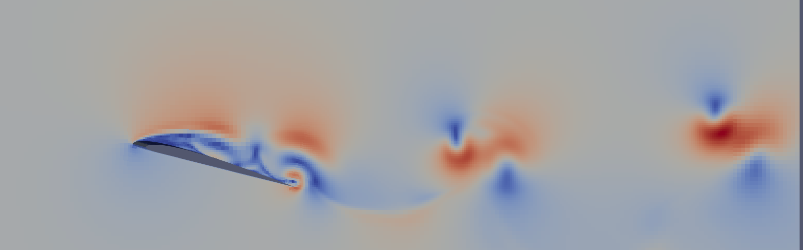
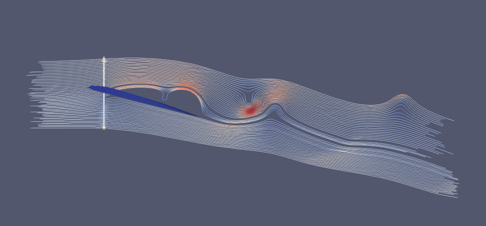
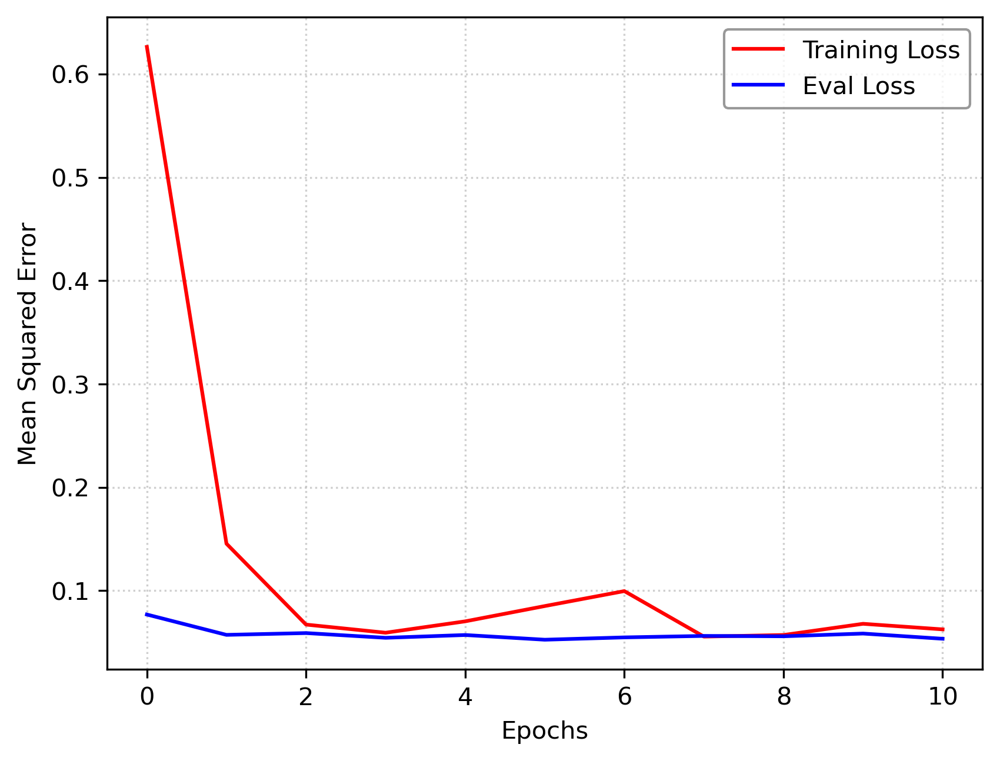

An end-to-end Machine Learning surrogate model designed to accelerate aerodynamic performance predictions for 2D airfoils in a steady, laminar flow regime. By replacing computationally expensive traditional Computational Fluid Dynamics (CFD) solvers with a Deep Multilayer Perceptron (MLP), this model achieves a **100,000× speedup**, bypassing a 30-minute simulation runtime down to sub-millisecond inference while retaining exceptional physical accuracy.

---

## 🚀 Performance Metrics & Impact

| Metric | Traditional CFD Solver | ML Surrogate Model | Impact / Accuracy |
| :--- | :--- | :--- | :--- |
| **Inference/Runtime** | ~30 minutes | **< 20 milliseconds** | **99.99% Compute Time Reduction** |
| **Drag Coeff. ($C_d$)** | Baseline | Predicted | **99.45% Accuracy** ($R^2 = 0.9717$) |
| **Lift Coeff. ($C_l$)** | Baseline | Predicted | **97.23% Accuracy** ($R^2 = 0.8235$) |

### Key Achievements:
* **Physics-Informed Realism:** Captures highly non-linear aerodynamic trends across a multi-dimensional design space, varying both **Angle of Attack ($\alpha$)** and **Reynolds Number ($Re$)**.
* **Design Space Exploration:** Enables rapid multi-objective design optimization loops and massive parametric sweeps (e.g., evaluating 1,000 design iterations in seconds instead of weeks of cluster compute time).

---

## 📈 Training Convergence

The model converges rapidly within the first 3 epochs due to the smooth, continuous nature of laminar fluid dynamics. Evaluation loss tracks seamlessly with training loss, demonstrating robust generalization across unseen test coordinates without overfitting.

* **Loss Function:** Mean Squared Error (MSE) on MinMax scaled features.
* **Final Scaled Eval Loss:** $\approx 0.05$

### 1. High-Fidelity CFD & Mesh Automation Pipeline

<table>
  <tr>
    <td align="center" width="33%">
      <b>O-Grid Surface Mesh</b> 
      
       <i>Figure 1: Refined O-grid boundary layer mesh tracking airfoil structural curvature.</i>
    </td>
    <td align="center" width="33%">
      <b>Velocity Visualization ($U$)</b> 
      
       <i>Figure 2: Global velocity magnitude contours across the steady laminar flow envelope.</i>
    </td>
    <td align="center" width="33%">
      <b>Streamline Tracer</b> 
      
       <i>Figure 3: Continuous velocity streaklines demonstrating laminar attachment and flow symmetry.</i>
    </td>
  </tr>
</table>

---

### 2. Neural Network Convergence & Verification

  
   <i>Figure 4: Deep Learning training vs. evaluation Mean Squared Error (MSE) showing clean convergence down to a 0.05 scaled steady-state by Epoch 10.</i>

├── airfoil_scraping_scripts/   # Scripts for automated geometry acquisition
├── cleaned_foils/              # Preprocessed and normalized airfoil profile coordinates
├── template_case/              # Base CFD case files (boundary conditions, solver settings)
├── nn_model/                   # PyTorch neural network architecture and training logs
|
├── case_generator.py           # Automates CFD case setup for varying Alpha and Re variations
├── stl_creator.py              # Generates 3D/2D STL surface meshes from airfoil coordinates
├── mesh_cases.py               # Handles automated mesh generation and quality checks
|
├── master_runner.slurm         # Core cluster job scheduling script for parallel CFD execution
├── start.slurm                 # Initialization script for HPC batch submission
├── generate_next_batch.py      # Active batch manager for step-wise data generation
|
├── data_reader.py              # Pipeline to parse, clean, and format simulation logs
├── sim_data.csv                # Aggregated dataset containing compiled CD and CL targets
├── diagnose.ipynb              # Notebook for error analysis and model validation
|
├── status.json                 # Real-time state tracking file for active pipeline runs
├── updateStatus.py             # Script monitoring simulation convergence and run status
└── RESET.py                    # Recovery script to safely clear cache and reset pipeline states

